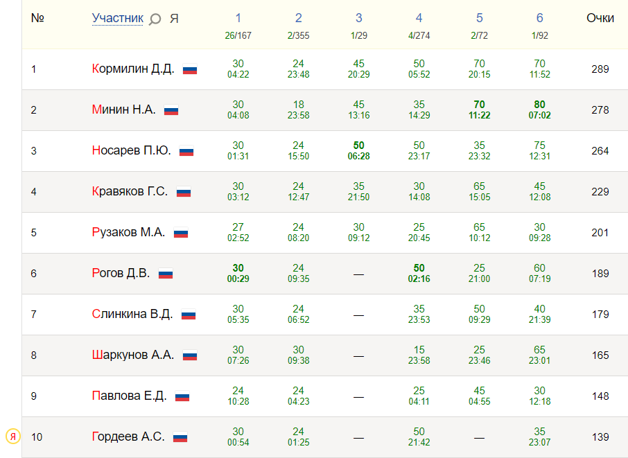

# Дистанционная Олимпиада по программированию 20.03.2021[^1]

## Мои результаты олимпиады:
№ | Задача | Баллы
:-:|:-----:|:----:
1 | Цветы | 30/30
2 | Багаж | 24/30
3 | Black or White? | 0/50
4 | Это просто! | 50/50
5 | Столы | 0/70
6 | Ассемблер | 35/80

В сумме: 139 баллов
10 место в общем зачёте и 6 место среди студентов

## Таблица результатов (Топ 10):

[^1]: Дополнительная информация об Олимпиаде: https://shgpi.edu.ru/forum/viewforum.php?f=238

