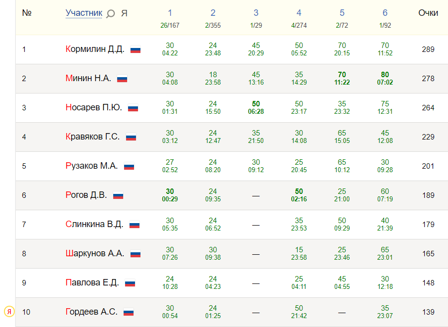

# Дистанционная Олимпиада по программированию 20.03.2021[[1]](#info)

## Мои результаты олимпиады:
№ | Задача | Баллы
:-:|:-----:|:----:
1 | [Цветы](https://github.com/MrSago/Olymp/tree/main/Olympiads/20.03.2021/1) | 30/30
2 | [Багаж](https://github.com/MrSago/Olymp/tree/main/Olympiads/20.03.2021/2) | 24/30
3 | [Black or White?](https://github.com/MrSago/Olymp/tree/main/Olympiads/20.03.2021/3) | 0/50
4 | [Это просто!](https://github.com/MrSago/Olymp/tree/main/Olympiads/20.03.2021/4) | 50/50
5 | [Столы](https://github.com/MrSago/Olymp/tree/main/Olympiads/20.03.2021/5) | 0/70
6 | [Ассемблер](https://github.com/MrSago/Olymp/tree/main/Olympiads/20.03.2021/6) | 35/80

В сумме: 139 баллов  
10 место в общем зачёте и 6 место среди студентов

## Таблица результатов (Топ 10):

<a name="info">[1]</a>: Дополнительная информация об Олимпиаде: https://shgpi.edu.ru/forum/viewforum.php?f=238

